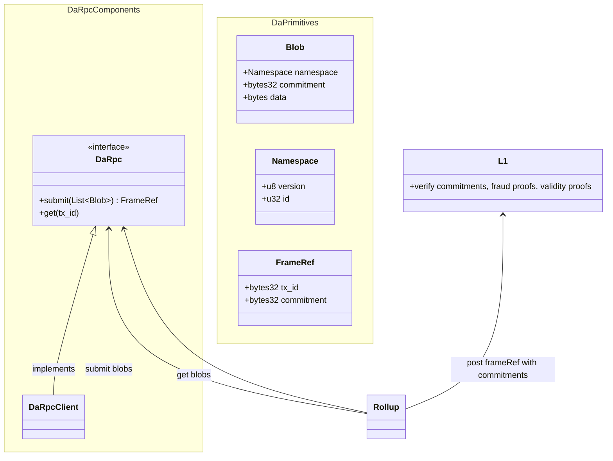

# Rpc client 

This diagram outlines how rollups written in rust would interact with the client.

```mermaid 
classDiagram 
    namespace DaRpcComponents {
        
        class DaRpcClient

        class DaRpc{
            <<interface>>
            +submit(List~Blob~) FrameRef
            +get(tx_id)
        }

    }

    namespace DaPrimitives {
        class Blob{
            +Namespace namespace
            +bytes32 commitment
            +bytes data
        }

        class Namespace {
            +u8 version
            +u32 id
        }

        class FrameRef {
            +bytes32 tx_id
            +bytes32 commitment
        }
    }
    DaRpc <|-- DaRpcClient : implements

    DaRpc >-- Rollup : submit blobs
    DaRpc >-- Rollup : get blobs

    class L1
    L1 : +verify commitments, fraud proofs, validity proofs
    L1 >-- Rollup : post frameRef with commitments
```

