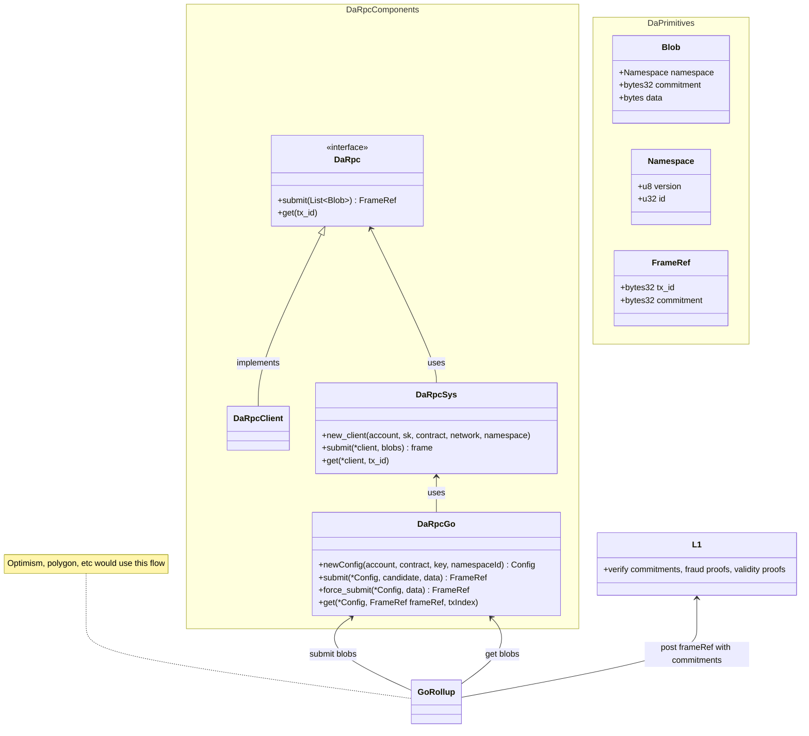

# Golang rpc client 

This diagram outlines how rollups written in golang would interact with the go rpc client.

```mermaid 
classDiagram 
    namespace DaRpcComponents {
        
        class DaRpcClient

        class DaRpc{
            <<interface>>
            +submit(List~Blob~) FrameRef
            +get(tx_id)
        }


        class DaRpcSys{
            +new_client(account, sk, contract, network, namespace)
            +submit(*client, blobs) frame
            +get(*client, tx_id)
        }

        class DaRpcGo {
            +newConfig(account, contract, key, namespaceId) Config
            +submit(*Config, candidate, data) FrameRef
            +force_submit(*Config, data) FrameRef
            +get(*Config, FrameRef frameRef, txIndex)
        }
    }

    namespace DaPrimitives {
        class Blob{
            +Namespace namespace
            +bytes32 commitment
            +bytes data
        }

        class Namespace {
            +u8 version
            +u32 id
        }

        class FrameRef {
            +bytes32 tx_id
            +bytes32 commitment
        }
    }

    DaRpc <|-- DaRpcClient : implements
    DaRpc >-- DaRpcSys : uses
    DaRpcSys >-- DaRpcGo : uses

    DaRpcGo >-- GoRollup : submit blobs
    DaRpcGo >-- GoRollup : get blobs

    class L1
    L1 : +verify commitments, fraud proofs, validity proofs
    L1 >-- GoRollup : post frameRef with commitments
    
    note for GoRollup "Optimism, polygon, etc would use this flow"
```

