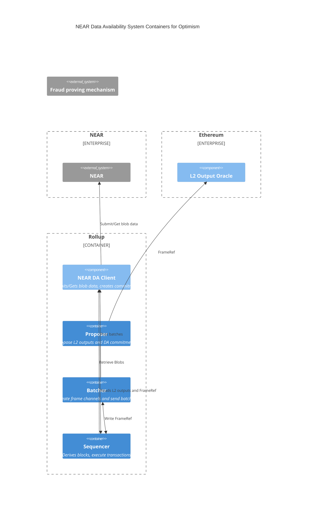

# Container diagram for optimism

```mermaid 
C4Container
    title NEAR Data Availability System Containers for Optimism
    
    Enterprise_Boundary(b3, "NEAR") {
        System_Ext(SystemNear, "NEAR")     
    }

    Enterprise_Boundary(b1, "Ethereum") {
        Component(L2Output, "L2 Output Oracle")        
    }     

    
    Container_Boundary(b2, "Rollup") {
        Component(DaClient, "NEAR DA Client", "Submits/Gets blob data, creates commitments")

        Container(Proposer, "Proposer", "Propose L2 outputs and DA commitments")
        Container(Batcher, "Batcher", "Create frame channels and send batches")
        Container(Sequencer, "Sequencer", "Derives blocks, execute transactions")

    }
        
    Rel_U(DaClient, SystemNear, "Submit/Get blob data")
    Rel(Batcher, DaClient, "Post batches")
    Rel(Sequencer, DaClient, "Retrieve Blobs")
    BiRel(Batcher, Sequencer, "Write FrameRef")

    Rel(Proposer, Sequencer, "Reads L2 outputs and FrameRef")
    Rel_D(Proposer, L2Output, "FrameRef") 
    
    UpdateLayoutConfig($c4ShapeInRow="2", $c4BoundaryInRow="2")

    System_Ext(FraudProofs, "Fraud proving mechanism")
```
