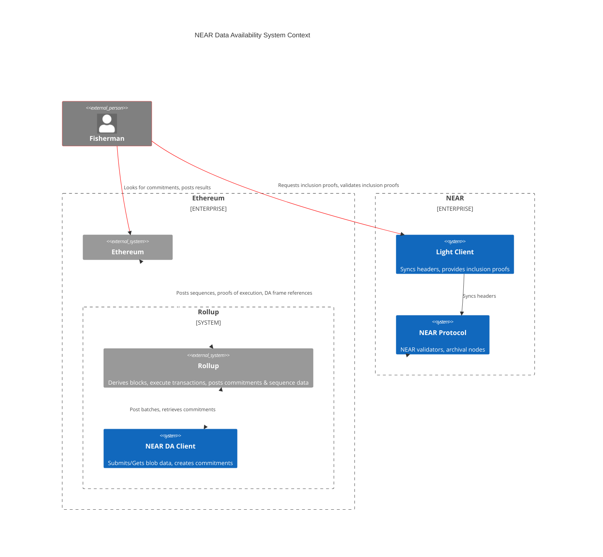

# System context

This outlines the system components that we build and how it interacts with external components.

```mermaid 
C4Context
    title NEAR Data Availability System Context

    Enterprise_Boundary(b1, "Ethereum") {
        System_Ext(SystemEth, "Ethereum")

        System_Boundary(b2, "Rollup") {
            System_Ext(SystemRollup, "Rollup", "Derives blocks, execute transactions, posts commitments & sequence data")
            System(SystemNearDa, "NEAR DA Client", "Submits/Gets blob data, creates commitments")
        }
        BiRel(SystemRollup, SystemEth, "Posts sequences, proofs of execution, DA frame references")
        BiRel(SystemRollup, SystemNearDa, "Post batches, retrieves commitments")
        Rel(fisherman, SystemEth, "Looks for commitments, posts results")
    }      
    
    Enterprise_Boundary(b0, "NEAR") {
        
        System(SystemLc, "Light Client", "Syncs headers, provides inclusion proofs")
        System(SystemNear, "NEAR Protocol", "NEAR validators, archival nodes")
        
        Rel(SystemLc, SystemNear, "Syncs headers")    
        Rel(SystemNearDa, SystemNear, "Submits/Gets blob")

        %% This doesn't exist yet
        %% System(SystemDas, "Data Availability Sampling", "Data redundancy, retrieval, sample responses")
        %% BiRel(SystemDas, SystemLc, "Commitments")
    }
     
    Person_Ext(fisherman, "Fisherman")
    Rel(fisherman, SystemLc, "Requests inclusion proofs, validates inclusion proofs")
      

    UpdateRelStyle(fisherman, SystemEth, $offsetY="-10" $lineColor="red")
    UpdateRelStyle(fisherman, SystemLc, $offsetY="-10", $lineColor="red")
    UpdateRelStyle(SystemRollup, SystemEth, $offsetY="-30", $lineColor="white")
    UpdateElementStyle(fisherman, $bgColor="grey", $borderColor="red")

    UpdateRelStyle(SystemRollup, SystemNearDa, $offsetX="-200", $lineColor="white", $textColor="white")
    UpdateRelStyle(SystemNearDa, SystemNear, $textColor="white", $lineColor="white", $offsetY="10")
    UpdateRelStyle(SystemNearLc, SystemNear, $offsetX="30")
```
